# Table of contents

* [About Rainbow Clubs](#about-rainbow-clubs)
* [Approach](#approach)
* [Use Case Ideas](#use-case-ideas)
* [Advanced Features](#advanced-features)
* [User Guide](#user-guide)
* [Community Feedback](#community-feedback)
* [Developer Guide](#developer-guide)
* [Our Team](#our-team)

# About Rainbow Clubs

* [Live Demo](http://rainbowclubs.meteorapp.com)
* [Github Repository](https://github.com/rainbowclubs/rainbowclubs)
* [Project Board Milestone 1 (Completed)](https://github.com/rainbowclubs/rainbowclubs/projects/1)
* [Project Board Milestone 2 (Completed)](https://github.com/rainbowclubs/rainbowclubs/projects/2)
* [Project Board Milestone 3 (In Progress)](https://github.com/rainbowclubs/rainbowclubs/projects/3)

The problem: UH Manoa has over 200 Registered Independent Organizations, plus many more that do not have this “official” status but are nonetheless active organizations. Unfortunately, there is no easy way for students to learn (a) what student clubs (both registered and unregistered) exist, what they do, and how to get further involved.

The solution: The Rainbow Clubs application will provide a centralized directory for UH Manoa student clubs. UH Manoa students can login to browse a well organized directory of all current student clubs, with brief descriptions, meeting times and locations, URLs to their websites (if any), contact information for officers, and a few select photos.

# Approach

Rainbow Clubs has three user roles, all of whom login with their UH ID. Regular users browse the directory. Club Admins have the ability to edit the data associated with their club. Super Admins make sure site content is appropriate and grant “club admin” privileges to selected users.

The site should not simply support browsing by a list of clubs in alphabetical order, but should also allow filtering by interest area. For example, “athletic” clubs, “art” clubs, “music” clubs, etc. A club can belong to multiple interest areas.

Users can specify interest areas, and be notified when a new club is created matching that interest area (or an existing club adds that interest area).

Admins can monitor the site for inappropriate content, and create new categories of musical tastes, capabilities, and goals.

# Use Case Ideas

* New user goes to landing page, logs in, gets home page, sets up profile.
* Admin goes to landing page, logs in, gets home page, edits site.
* User goes to landing page, logs in, looks for clubs of interest.
* Club admin goes into site, updates their club profile.

# Advanced Features

* Upload club data from the CSV version of the RIO spreadsheet.
* Notify admins when club data changes so they can review for appropriateness.
* Provide “expiration date” for club listings (either one semester or one academic year). To retain a listing, the club admin or admin must login and click a “renew” button for the club to re-list it in the site.
* Allow students to rate clubs.

# User Guide
The following sections describe the main features of this application as of Milestone 3.

## Landing Page
The goal of this page is to describe the function of the website.
When you retrieve the application at [http://localhost:3000](http://localhost:3000), you will receive the following page:


## Login Page
Clicking on the Login link and then on the Sign In menu item, you will receive the following page:

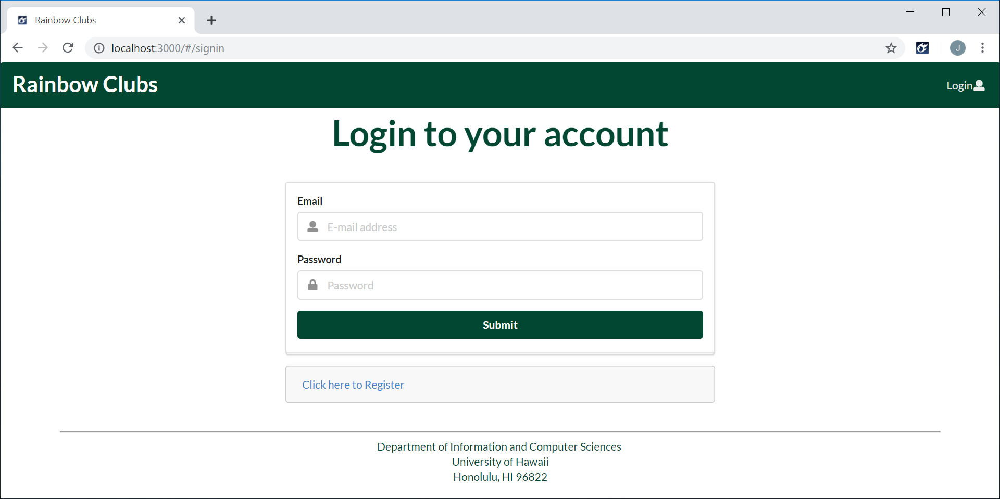

## Register Page
Clicking on the Login link and then on the Sign Up menu item, you will receive the following page:


## Landing Page After Login (General User)
Once a general user logs in or registers, the landing page will contain a listing of three random clubs and a link to view the complete club listing:

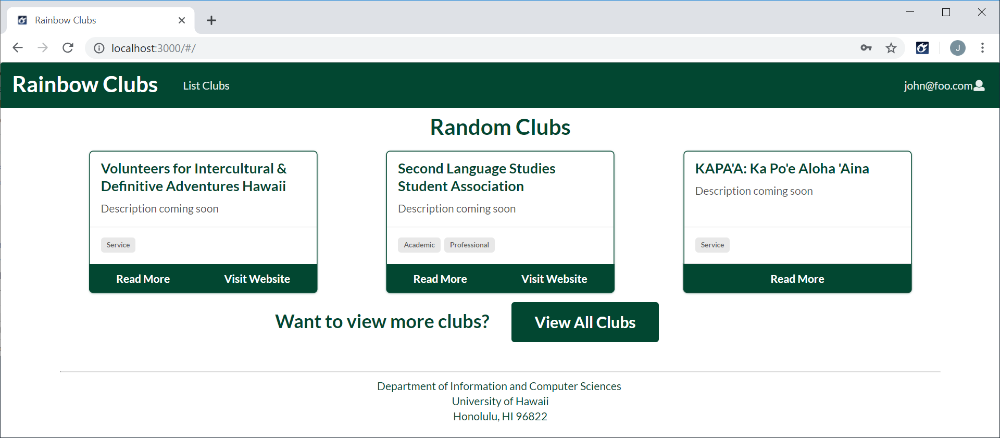

## Landing Page After Login (Club Admin User)
Once a club admin logs in, the landing page will contain the general user content, and a listing of any clubs the user is an admin of:

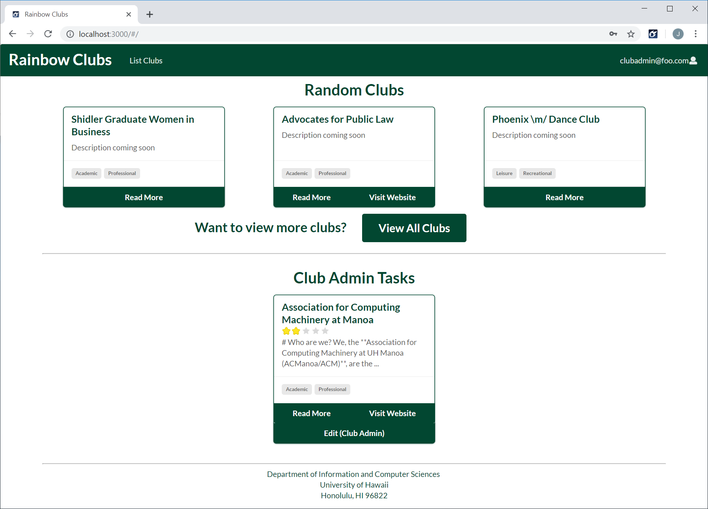

## Landing Page After Login (Moderator User)
Once a moderator logs in, the landing page will contian the general user and club admin content, and a list of moderator tasks:

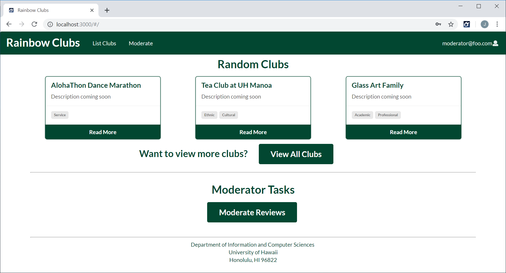

## Landing Page After Login (Super Admin User)
Once a super admin logs in, the landing page will contian the general user, club admin and moderator content, and a list of admin tasks:

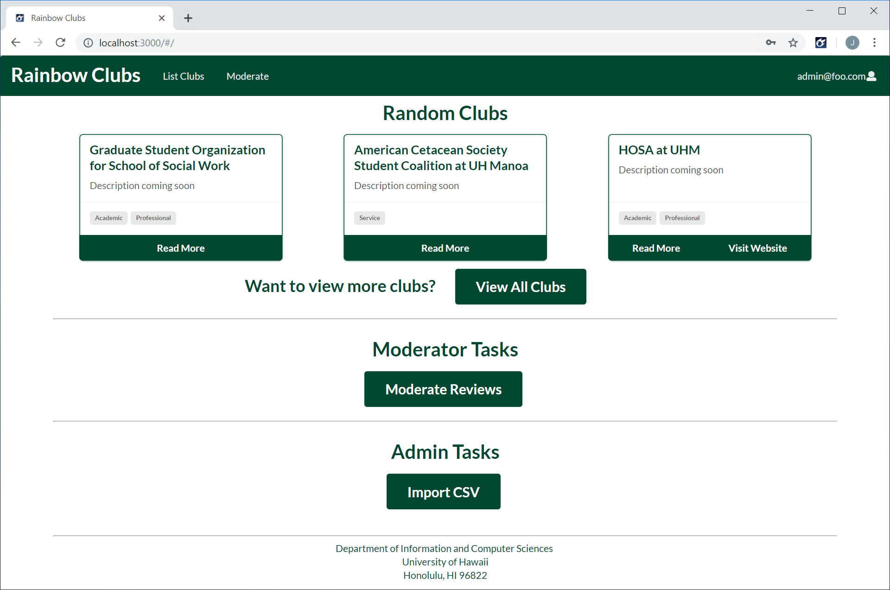

## User Settings Page (All Users)
Once a user has logged in, by clicking on their email in the top menu and then on the Settings menu item, they will receive the users settings page.  The purpose of this page is to allow the user to pick their perferred type(s).  The perferred type(s) will be used to filter the random clubs on the landing page after a user logs in.

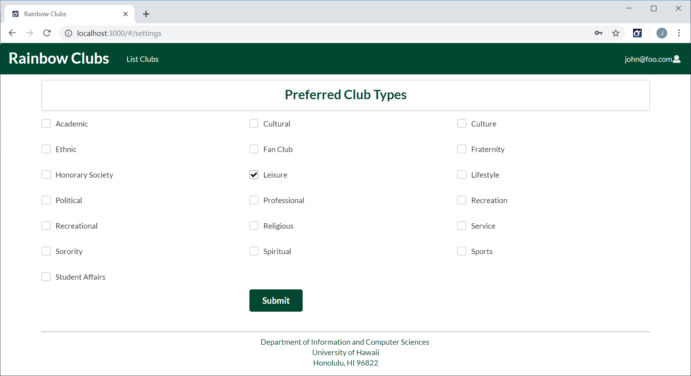

## Club Listing Page (All Users)
Once a user has logged in, by clicking on List Clubs in the top menu, they will receive the club listing page.  The purpose of this page is to list all registered RIOs and clubs in the UH database.  Each club will have a card that will contain an average rating (if reviewed), description, tags, a link to the RIO/club website (if they have one), and a link to a seperate page that will have further descriptions of the RIO/club.  Users are able to search based on name and/or type.

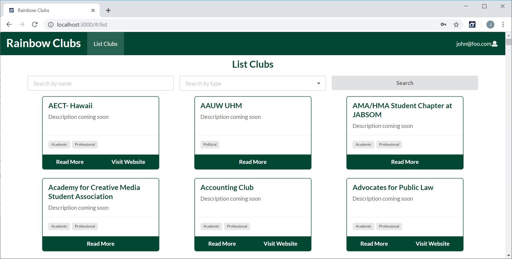

## Club Details Page (All Users)
The purpose of this page is to display information about a club to the user.  The description will initially be blank, but club admins and super admins have the ability to modify it (markdown is supported).


If a club has any reviews, the reviews will be listed under the club description.

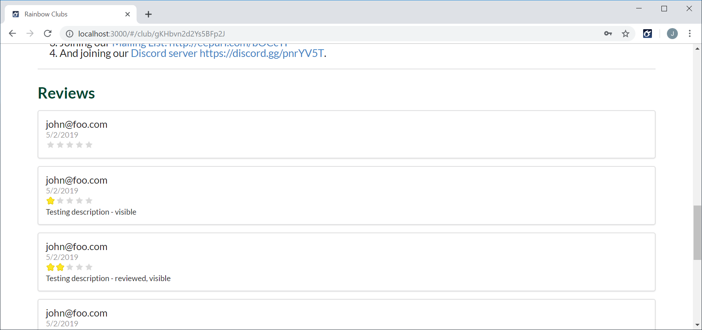

Users are able to rate and leave a review about a club.

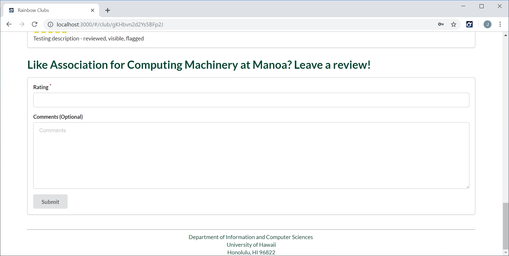

## Edit Club Page (Club Admin and Super Admin Users)
The purpose of this page is to allow club admins and super admins to modify the content of a club's page.

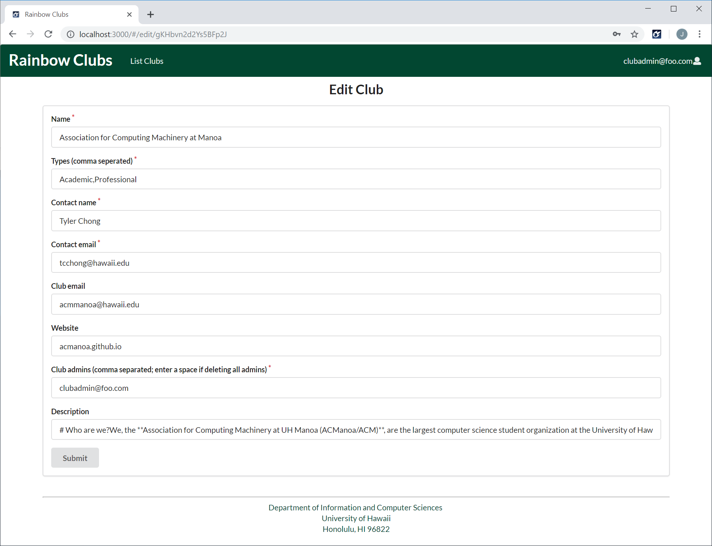

## Review Listing Page (Moderator and Super Admin Users)
The purpose of this page is to list the user reviews that need to be reviewed by a moderator or super admin.

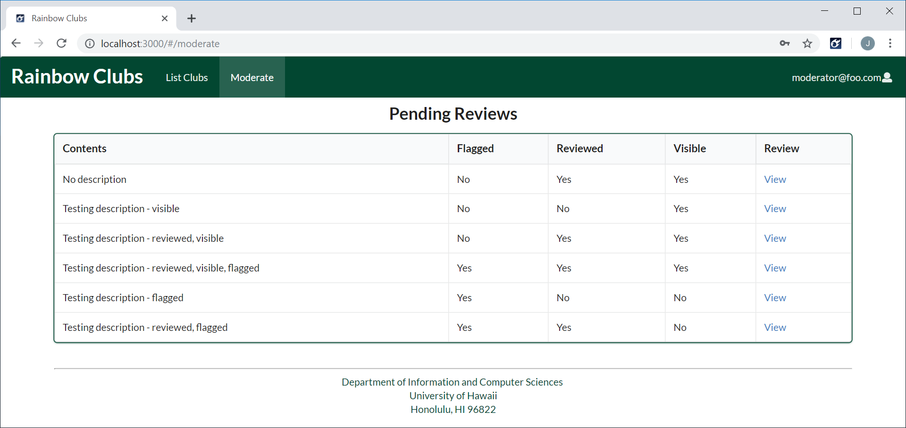

## Review Details Page (Moderator and Super Admin Users)
The purpose of this page is to display details about a user review and allow a moderator or super admin to mark it invisible if it contains inappropiate content.

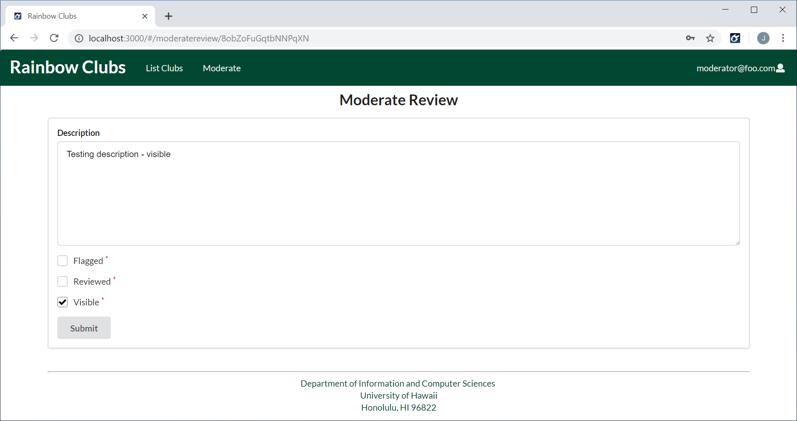

## Review Pending Club Modifications (Moderator and Super Admin Users)

The purpose of this page is to display details about a club review and allow a moderator or super admin to mark it invisible if it contains inappropriate content.


## Import CSV Page (Admin Users)
Clicking on the Import CSV link on the super admin landing page, you will receive the following page:

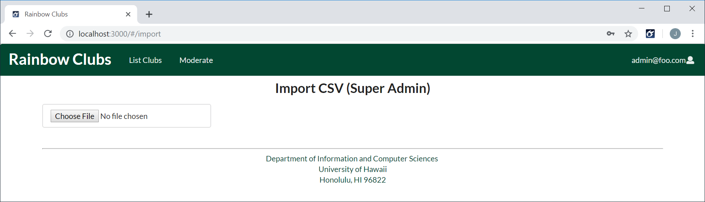

Once a CSV file is loaded and parsed, any changes (new, updated and deleted clubs) will be displayed for review and approval:

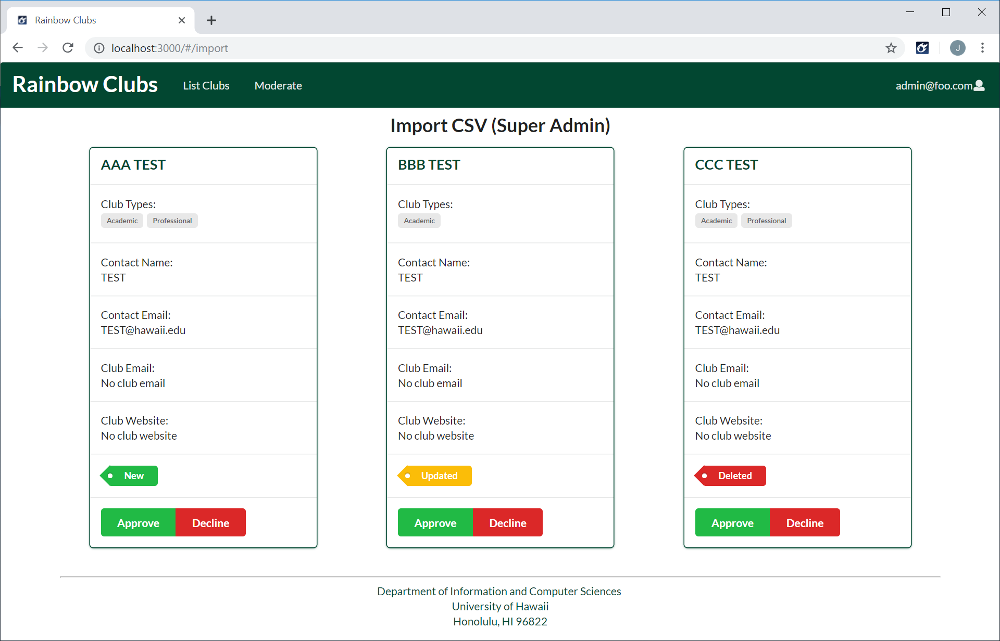

# Community Feedback
We interviewed five UH community members to get their opinions on our project, here's what they said:

Kevin W.
- Did not like the review rating selection, did not know how to enter initially
- Was expecting more information on the view club page
- Liked the overall look of website

Leigton V.
- Liked the overall look of the website
- Thought type tags should be click-able
- Thought the moderate review page needs work
- Would have liked to see more information about the clubs
- Did not feel add review was intuitive

Herman L.
- Thought landing page could use work
	- Separation between sections
	- Make clubs displayed click-able
- Add review
	- Add placeholder to comments field
	- Ratings should be click-able stars or drop down (--, zero (0), one (1), two (2), ...)
- Make "quality of life" improvements (improve usability) to entire website

Zac K.
- Thought components on the landing page should be click-able
- Listing page
	- Should show ratings of clubs, if reviewed
	- Should include ability to filter based on rating
- View club
	- Was expecting more details about clubs
	- Add review should have a larger header
	- Add review comment should be a larger field
- Moderate reviews
	- Listing page should separate by status
	- Moderate page should list which club the review is for
- Import CSV page should have links to the added/modified pages in the Bert message

Trevin T.
- Liked the UH color schema, thought it was a clean look, but felt it could use more color
- Liked the landing page, but thought components should be click-able
- Thought type tags should link to search results for the type
- Thought overall functionality was good and the website would be useful to the UH community

# Developer Guide

## Backend System

This application was built on meteor-application-template-react.  For information regarding this template, please refer to [https://ics-software-engineering.github.io/meteor-application-template-react/](https://ics-software-engineering.github.io/meteor-application-template-react/)

## Installation

First, [install Meteor](https://www.meteor.com/install)

Optionally, create a new GitHub repository and clone it to your local machine.

Second, [download a copy of Rainbow Clubs](https://rainbowclubs.github.io/).

Third, uncompress the zip file and copy the files and directories into your working directory.

Fourth, in a terminal window, change to the app directory and install the required libraries:

```
cd /path/to/project
cd /app
meteor npm install
```

## Running the Application

Once you have completed the installation, you can start the application:

```
meteor npm run start
```

The first time you run the application, it will create some default users and date. Note that you can safely ignore warning about bcrypt.

## Viewing the Application

Once you have completed the installation and started up the application, you should be able to access it at [http://localhost:3000](http://localhost:3000). You can login using the default users, or register a new account.

# Our Team

* [Audrey Ford](https://audreyford.github.io/)
* [John Dobbs](https://john-dobbs.github.io/)
* [Anthony Cathers](https://acathers.github.io/)
* [Leland Machii](https://lmachii.github.io/)
